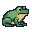

## ✨ Greetings, Traveller!
You’ve wandered into **Rebecca’s GitHub Lair**, a snug little cavern full of curious contraptions, half‑finished spells, and code held together by moss, vibes, and questionable arcane decisions.

---

## Current Quests
- Crafting magical little projects that may or may not explode
- Levelling up my skills like a wizard grinding XP in a forest
- Practising my Tailwind sorcery and learning to wield its utility‑magic
- Trying to get to grips with React, one component at a time
- Collecting shiny bugs (the code kind… mostly)

---

## Lore
- I hoard CSS snippets like a dragon hoards treasure  
- My commit messages range from “fixed it” to “why is this happening”  
- I believe every project deserves a little bit of whimsy  
- If you hear cackling, I’ve just solved a bug in the most unhinged way possible

---

  

